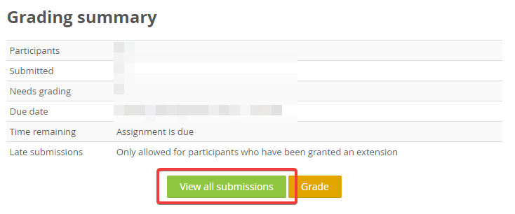
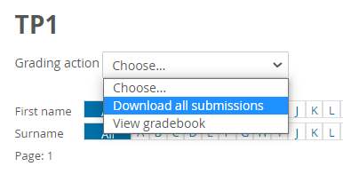
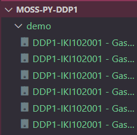

# Tutorial Penggunaan moss.py untuk Plagiarism Checker DDP1

**Outline**

1. [Instalasi](#Instalasi)
2. [Registrasi](#Registrasi)
3. [Persiapan Script](#Persiapan-Script)
4. [Menggunakan Script](#Menggunakan-Script)
5. [File yang Dibutuhkan](#File-yang-Dibutuhkan) (zip of zips)

## Instalasi 
Instalasi dapat dilakukan dengan *package installer* untuk Python (``pip``). Paste *command line* berikut di terminal favorit anda:

```
pip install mosspy rich
```

## Registrasi
Untuk menggunakan library ``moss.py``, perlu dilakukan registrasi dengan mengirimkan *email* ke ``moss@moss.stanford.edu`` dengan isi email sebagai berikut: 

```
registeruser
mail username@domain
```

Ganti ``username@domain`` dengan *email* anda. Setelah mengirim *email*, pihak moss akan mengirimkan sebuah *autoreply*. Cari potongan pesan seperti di bawah ini pada *autoreply*:

```
# The userid is used to authenticate your queries to the server; don't change it!
#
$userid=xxxxxxxx; 
```
**Note: Akan lebih mudah jika mencari menggunakan ``Ctrl + F`` atau ``F3``.**

Simpan nilai dari *variable* ``userid``. Nilai ini akan digunakan untuk menggunakan *library* ``moss``. 

## Persiapan Script
Telah dilampirkan *script* bernama ``moss_tp.py`` yang terdapat pada *root directory*.

Berikut beberapa hal yang perlu diubah atau diisi: 
1. Pada baris 9, isi variable `folder` dengan nama folder tempat anda menyimpan file yang ingin dicek.

   ```python
   folder = ".\\demo" ## CHANGE: to folder containing zipfile of every class 
   ```

   **Note: Gunakan \\\ untuk meng-*escape* backslash**

2. Pada baris 10, isi variable `userid` sesuai dengan nilai yang disimpan ketika melakukan fase registrasi.

   ```python
   userid = 000000000 ## CHANGE: to your user id	
   ```

2. Pada baris 21, isi variable sesuai dengan lokasi *template file* yang digunakan (bila ada).

   ```python
   # sesuaikan dengan penamaan berkas.
   # jika tidak menggunakan template, silahkan block comment potongan kode ini
   template_filename = "./template_labxx/TemplateXX.py"
   m.addBaseFile(template_filename)
   ```

​		**Note: *comment block* potongan kode ini jika memang tidak memakai template kode.**

4. Save file script yang telah diubah.

## Menggunakan Script

### `moss_tp.py`
Untuk melakukan pengecekan, jalankan *command line* ini:

```
python moss_tp.py
```
Secara singkat, script akan membantu anda mempersiapkan file TP/Lab untuk dicek oleh Moss. Alangkah baiknya bila anda membaca petunjuknya baik-baik supaya tidak sakit kepala (sumber: pengalaman pribadi). 

**Silakan jalankan script menggunakan contoh file zip of zip yang sudah disediakan di folder `./demo` untuk mencoba sendiri.**

Terdapat 3 langkah persiapan: 

1. Extract file [zip of zip](#File yang Dibutuhkan) setiap kelas (dibahas di section berikutnya)
2. Extract file python dari dalam zip
3. Rename file python supaya hasil pengecekan mudah dibaca

Checker akan menghasilkan output berupa sebuah URL seperti di bawah ini:

```
Report URL: http://moss.stanford.edu/results/4/665016126326
```
**Harap diperhatikan URL Moss hanya valid untuk sekitar 3 hari.**

Berikut contoh tampilan halaman dengan ``URL`` yang dihasilkan dari *checker script*.


Halaman akan menampilkan pasangan *submission* yang terindikasi plagiat. Anda dapat melihat baris kode mana saja yang sama dengan mengklik salah satu nama file. Nanti akan muncul tampilan seperti di bawah ini:


**Disclaimer: Nama mahasiswa pada berkas contoh bersifat fiktif. Jika terdapat kesamaan dengan nama seorang individu di dunia nyata, itu merupakan murni suatu kebetulan.**

Langkah berikutnya yang anda lakukan adalan mengkomunikasikan hasil tersebut pada tim dosen untuk ditindaklanjuti. 

### `scrape_report.sh`

Karena link Moss hanya valid selama 3 hari, dapat dilakukan scraping untuk menyimpan HTML hasil laporan di device lokal. Untuk itu, dapat digunakan script `scrape_report.sh` dengan langkah-langkah seperti berikut

1. Lakukan `source scrape_report.sh`

2. Panggil commandnya dengan `scrape_report <url>`.
   Contoh bentuk pemanggilannya dengan URLnya adalah sebagai berikut:
      
      ```
      scrape_report http://moss.stanford.edu/results/6/9408393705181/
      ```
   Penting untuk diperhatikan bahwa pada link terdapat **protokol** pada awal dan **forward slash** pada akhir URL.
   
3. Hasil akan disimpan dalam folder yang terstruktur sesuai link di atas, dalam `moss.stanford.edu/<angka>/<id>/`.
   
Disarankan untuk menjalankan scraping hasil Moss tertentu dalam _directory_ yang berbeda, sebab `wget` dapat tidak sengaja meng-_overwrite_ file pada report yang sudah ada.

**Catatan**: Script scraper membutuhkan utility berikut dalam sistem Anda: `bash`, `wget`, `find` dan `sed`. Jika Anda menggunakan Windows dan bisa menulis versi script untuk PowerShell/batch/dll., sangat dipersilahkan untuk men-_submit_ sebuah pull request untuk versi Windows agar bisa digunakan lebih banyak asdos lainnya.

## File yang Dibutuhkan

Script ini membutuhkan file zip dari submission setiap kelas. Didapatkan dengan mudah via scele dengan langkah sebagai berikut. 

1. Buka submission slot yang bersangkutan dan klik view all submission

   

2. Buka dropdown `Grading action` dan pilih download all submissions.

   

3. Sudah deh. 
   File tersebut adalah zip of zip yang anda butuhkan untuk menjalankan script. 

4. Kalau menjalankan untuk satu angkatan, disarankan untuk meminta file setiap kelas dari asdos masing-masing kelas. Simpan semua file tersebut di folder yang sama, lalu jalankan script. Contoh: 

   


---

Semoga script ini bisa meringankan sakit kepala anda. 

Courtesy to [spectrum71](https://github.com/spectrum71/Moss-For-DDP1) who provided the core moss library usage example and the original tutorial. 

If you got any questions, ask me on discord Lyth#0912

